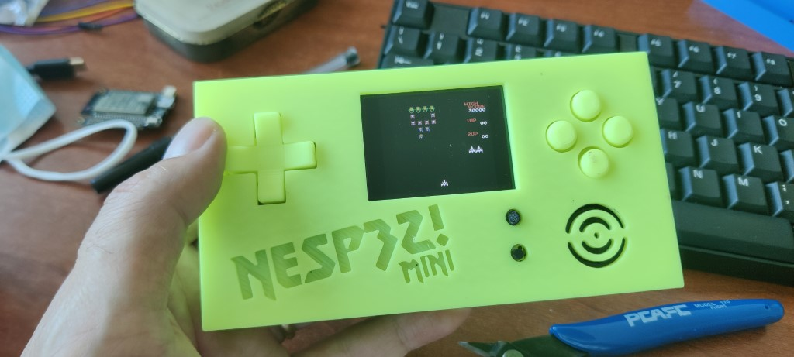

# Retrogaming: NES + ESP32 = NESP32!

Example projects for **ESP32-DevKitC-Multimedia-Board** by **ZioTester Lab**.

Info, guides, tutorials and documentation: [HERE](http://ziotester.github.io/retrogaming/nesp32/)

